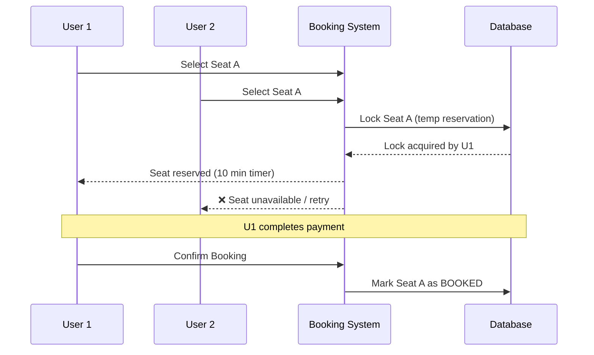

# 🟡 Blinkit (Eternal) — SDE-1 Interview Experience

> **Result: ✅ Offer Received
> *Published: June 2026 · By Sanuj Tiwari***
>
> **Link**: [Blinkit (Eternal) SDE-1 Interview Experience (June 2026) – Offer Received](https://devbrainiac.com/blogs/139/blinkit-eternal-sde-1-interview-experience-june-2026-offer-received/ "Blinkit (Eternal) SDE-1 Interview Experience (June 2026) – Offer Received")

---

## 📋 Quick Overview

| Field                        | Details                                 |
| ---------------------------- | --------------------------------------- |
| **Company**            | Blinkit (Eternal)                       |
| **Role**               | Software Development Engineer I (SDE-1) |
| **Location**           | Gurgaon                                 |
| **Experience**         | 1 Year                                  |
| **Education**          | B.Tech from Tier-1 College              |
| **Interview Mode**     | Remote                                  |
| **Interview Rounds**   | 3                                       |
| **Result**             | ✅ Selected                             |
| **Total CTC (Year 1)** | ₹30 LPA                                |
| **Process Duration**   | ~10 Days                                |

---

## 💼 Compensation Breakdown

| Component                    | Amount             |
| ---------------------------- | ------------------ |
| Fixed Salary                 | ₹25 LPA           |
| Joining Bonus (One-Time)     | ₹5 LPA            |
| **Total CTC (Year 1)** | **₹30 LPA** |

---

## 🧭 Background & Motivation

At the time of applying, the candidate had ~1 year of experience at a large MNC. Despite the stability, the role felt limiting:

* 🔴 Low-impact work with limited learning
* 🔴 Minimal technical exposure
* 🟢 Wanted to move to a **fast-paced product company**
* 🟢 Seeking **challenging engineering problems**

> **Bold Move:** Resigned *without* another offer in hand to focus fully on interview preparation.

---

## 🗺️ Interview Process Overview

```
Recruiter Screening
       │
       ▼
┌──────────────────────┐
│  Round 1             │
│  Problem Solving     │  ← SDE-III (5 yrs) · 60 min · Medium
└──────────┬───────────┘
           │
           ▼
┌──────────────────────┐
│  Round 2             │
│  System Design +     │  ← SDE-III (7 yrs) · 75 min · Medium-Hard
│  Problem Solving     │
└──────────┬───────────┘
           │
           ▼
┌──────────────────────┐
│  Round 3             │
│  Culture Fit         │  ← Tech Lead (13 yrs) · 30 min · Moderate
└──────────┬───────────┘
           │
           ▼
        ✅ OFFER
```

---

## 📞 Recruiter Screening Call

The recruiter reached out proactively and covered:

* Overview of the **3-round hiring process**
* Role expectations and **team structure**
* **Work culture** at Blinkit
* Interview slots were scheduled **quickly and professionally**

---

## 🔵 Round 1 — Problem Solving

| Attribute             | Detail                       |
| --------------------- | ---------------------------- |
| **Interviewer** | SDE-III (5 Years Experience) |
| **Duration**    | 60 Minutes                   |
| **Difficulty**  | Medium                       |

> *"The primary goal of the round was to evaluate how candidates think under pressure and approach problem-solving rather than test obscure algorithms."*

---

### Problem 1 — House Robber *(LeetCode Medium)*

**Problem:** Maximize money robbed from houses such that no two adjacent houses are robbed.

---

#### Approach 1 — Recursive (Brute Force)

```java
class Solution {
    public int rob(int[] nums) {
        return solve(0, nums);
    }

    private int solve(int index, int[] nums) {
        if (index >= nums.length) {
            return 0;
        }
        // Take and Non-Take type DP problem
        int rob  = nums[index] + solve(index + 2, nums);
        int skip = solve(index + 1, nums);
        return Math.max(rob, skip);
    }
}
```

#### Approach 2 — Memoization (Top-Down DP)

```java
class Solution {
    public int rob(int[] nums) {
        Integer[] dp = new Integer[nums.length];
        return solve(0, nums, dp);
    }

    private int solve(int index, int[] nums, Integer[] dp) {
        if (index >= nums.length) return 0;
        if (dp[index] != null)   return dp[index];

        int rob  = nums[index] + solve(index + 2, nums, dp);
        int skip = solve(index + 1, nums, dp);
        return dp[index] = Math.max(rob, skip);
    }
}
```

#### Approach 3 — Bottom-Up DP (Tabulation)

```java
class Solution {
    public int rob(int[] nums) {
        int n = nums.length;
        if (n == 1) return nums[0];

        int[] dp = new int[n];
        dp[0] = nums[0];
        dp[1] = Math.max(nums[0], nums[1]);

        for (int i = 2; i < n; i++) {
            dp[i] = Math.max(dp[i - 1], dp[i - 2] + nums[i]);
        }
        return dp[n - 1];
    }
}
```

#### Approach 4 — Space-Optimized DP ⭐ *(Best)*

```java
class Solution {
    public int rob(int[] nums) {
        int prev2 = 0; // dp[i-2]
        int prev1 = 0; // dp[i-1]

        for (int money : nums) {
            int curr = Math.max(prev1, prev2 + money);
            prev2 = prev1;
            prev1 = curr;
        }
        return prev1;
    }
}
```

**Optimization Journey:**

```
Brute Force O(2ⁿ)  →  Memoization O(n)  →  Tabulation O(n)  →  Space-Opt O(1) space
```

---

### Problem 2 — House Robber II *(LeetCode Medium)*

**Problem:** Same as above but houses are arranged in a **circle** (first and last are adjacent).

**Key Insight:**

> First and last houses cannot both be robbed. Split into two linear subproblems and take the maximum.

* `solve(nums, 0, n-2)` — exclude last house
* `solve(nums, 1, n-1)` — exclude first house

```java
class Solution {
    public int rob(int[] nums) {
        int n = nums.length;
        if (n == 1) return nums[0];

        return Math.max(
            solve(nums, 0, n - 2),
            solve(nums, 1, n - 1)
        );
    }

    private int solve(int[] nums, int start, int end) {
        if (start > end) return 0;

        int rob  = nums[start] + solve(nums, start + 2, end);
        int skip = solve(nums, start + 1, end);
        return Math.max(rob, skip);
    }
}
```

---

### 🗄️ Database Discussion

After coding, the interview shifted to system fundamentals:

* **SQL vs NoSQL** — differences and use cases
* **When to choose NoSQL** over relational databases
* **Redis internals** — how it works under the hood
* **Redis as sole database** — risks and pitfalls
* **Durability & persistence challenges** in Redis

---

## 🟠 Round 2 — System Design + Problem Solving

| Attribute             | Detail                       |
| --------------------- | ---------------------------- |
| **Interviewer** | SDE-III (7 Years Experience) |
| **Duration**    | 75 Minutes                   |
| **Difficulty**  | Medium–Hard                 |

> *"This round was originally intended to be a System Design round, but surprisingly started with a DSA problem."*

---

### DSA Problem — Construct arr3 from arr1 and arr2

**Problem Statement:**

Given two arrays of unique numbers, determine if there exists an `arr3` such that:

* Both `arr1` and `arr2` are **subsequences** of `arr3`
* All elements in `arr3` remain **unique**

```
arr1 = [2, 3, 5, 1]
arr2 = [4, 3, 5, 1, 9]

arr3 = [2, 4, 3, 5, 1, 9]  →  Answer: TRUE ✅
```

```
arr1 = [2, 3, 5, 1]
arr2 = [2, 3, 1, 5]

Answer: FALSE ❌  (ordering conflict → cycle detected)
```

**Core Insight:** Model ordering constraints as a **directed graph** and check for cycles using  **Topological Sort (Kahn's Algorithm)** .

#### Algorithm

```
1. Build a directed graph from ordering constraints in arr1 and arr2
2. Compute in-degree of each node
3. Run Kahn's Topological Sort (BFS)
4. If all nodes processed → valid ordering exists → TRUE
5. If cycle detected → impossible → FALSE
```

#### Implementation

```java
import java.util.*;

class Solution {

    public boolean canConstruct(int[] arr1, int[] arr2) {
        Map<Integer, Set<Integer>> graph    = new HashMap<>();
        Map<Integer, Integer>      indegree = new HashMap<>();

        // Register all nodes
        for (int num : arr1) {
            graph.putIfAbsent(num, new HashSet<>());
            indegree.putIfAbsent(num, 0);
        }
        for (int num : arr2) {
            graph.putIfAbsent(num, new HashSet<>());
            indegree.putIfAbsent(num, 0);
        }

        buildEdges(arr1, graph, indegree);
        buildEdges(arr2, graph, indegree);

        // Kahn's BFS Topological Sort
        Queue<Integer> queue = new LinkedList<>();
        for (int node : indegree.keySet()) {
            if (indegree.get(node) == 0) queue.offer(node);
        }

        int visited = 0;
        while (!queue.isEmpty()) {
            int curr = queue.poll();
            visited++;
            for (int next : graph.get(curr)) {
                indegree.put(next, indegree.get(next) - 1);
                if (indegree.get(next) == 0) queue.offer(next);
            }
        }

        return visited == indegree.size();
    }

    private void buildEdges(int[] arr,
                            Map<Integer, Set<Integer>> graph,
                            Map<Integer, Integer> indegree) {
        for (int i = 0; i < arr.length - 1; i++) {
            int u = arr[i], v = arr[i + 1];
            if (graph.get(u).add(v)) {
                indegree.put(v, indegree.get(v) + 1);
            }
        }
    }
}
```

---

### 🏗️ System Design — Ticket Booking System (BookMyShow-style)

> The interviewer focused on **specific engineering decisions and tradeoffs** rather than an end-to-end design.

---

#### Scenario 1 — Handling High-Traffic Events

**Problem:** Millions of users simultaneously trying to book for a popular event.

**Solutions Discussed:**

| Strategy              | Purpose                       |
| --------------------- | ----------------------------- |
| Virtual Waiting Rooms | Queue users before admission  |
| Rate Limiting         | Prevent server overload       |
| Queue-Based Admission | Controlled, fair user flow    |
| CDN Caching           | Offload static content        |
| Read Replicas         | Scale read-heavy DB queries   |
| Event Partitioning    | Distribute load across shards |

---

#### Scenario 2 — Seat Locking Problem

**Problem:** Two users attempt to book the **same seat** simultaneously.



**Locking Strategies:**

| Approach                      | Mechanism                        | Pros               | Cons                 |
| ----------------------------- | -------------------------------- | ------------------ | -------------------- |
| **Pessimistic Locking** | Lock immediately on selection    | Strong consistency | Reduced concurrency  |
| **Optimistic Locking**  | Version-based conflict detection | Better scalability | Requires retry logic |

**Redis in Seat Reservation:**

* Used for **temporary seat locks** with TTL (Time-To-Live)
* Fast in-memory operations for high-throughput scenarios
* Lock expiration prevents indefinitely held seats

---

## 🟢 Round 3 — Culture Fit

| Attribute             | Detail                          |
| --------------------- | ------------------------------- |
| **Interviewer** | Tech Lead (13 Years Experience) |
| **Duration**    | 30 Minutes                      |
| **Difficulty**  | Moderate                        |

> *"Instead of asking technical implementation questions, he focused on understanding how I think about product and business challenges."*

The interviewer joined slightly late and quickly pivoted to  **business-oriented problem-solving scenarios** . Rather than completing one problem fully, he frequently switched contexts and introduced new scenarios — making the round feel more like a **rapid brainstorming session** than a structured interview.

---

### 🗣️ Discussion Topics

The conversation revolved around:

* 🧠 **Product thinking** — how to approach product challenges
* ⚖️ **Business tradeoffs** — balancing engineering decisions with business impact
* 🔍 **Problem-solving approach** — reasoning under ambiguity
* ⚡ **Working in high-growth environments** — comfort with pace and change
* 🤝 **Team collaboration** — working styles and cross-functional dynamics

---

### 📍 Relocation Discussion

Toward the end of the interview, the conversation shifted to logistics and future planning:

* Willingness to **relocate to Gurgaon**
* **Team preferences** within Blinkit
* **Interest in different engineering domains**
* **Long-term career goals**

> *The round ended fairly abruptly because of time constraints.*

---

## 📊 Difficulty Ratings

| Round   | Type                | Difficulty      |
| ------- | ------------------- | --------------- |
| Round 1 | Problem Solving     | 🟡 Medium       |
| Round 2 | System Design + DSA | 🔴 Medium–Hard |
| Round 3 | Culture Fit         | 🟡 Medium       |

---

## ✅ What Went Well

* 😊 Friendly and supportive interviewers throughout
* 🎯 Focus on **fundamentals** over puzzle-style questions
* 🏗️ Real-world, practical system design discussions
* ⚡ Quick recruiter communication and fast feedback
* 📅 Entire process completed in **~10 days**

---

## 📚 Preparation Areas That Helped

* ✅ **Dynamic Programming** — especially take/skip patterns
* ✅ **Database Concepts** — SQL vs NoSQL, Redis internals
* ✅ **Concurrency & Locking** — pessimistic vs optimistic
* ✅ **Graph Algorithms** — topological sort, cycle detection
* ✅ **System Design Fundamentals** — caching, queuing, replication
* ✅ **Product & Business Thinking** — tradeoffs, real-world judgment

---

## 💡 Key Takeaways

> **For Blinkit SDE-1, focus less on extremely hard competitive programming and more on building strong fundamentals.**

1. **Medium-level DP** is sufficient — know the optimization ladder (brute → memo → tabulation → space-opt)
2. **Database fundamentals** matter — SQL, NoSQL, Redis tradeoffs
3. **System design** is practical — expect real tradeoffs, not textbook diagrams
4. **Explain your thought process** — interviewers value reasoning over memorized solutions
5. **Business thinking** is tested — be ready for product scenarios in later rounds

---

*Overall, a very positive experience. Fast, fair, and engineering-focused.*
