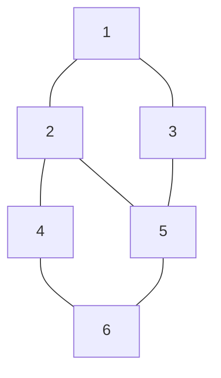

# Graph Representation Using Adjacency Matrix in Java

Consider the following undirected graph with 6 vertices.

## Graph Visualization



### Edge List

```text
1 -- 2
1 -- 3
2 -- 4
2 -- 5
3 -- 5
4 -- 6
5 -- 6
```

## Adjacency Matrix

|             | 1 | 2 | 3 | 4 | 5 | 6 |
| ----------- | - | - | - | - | - | - |
| **1** | 0 | 1 | 1 | 0 | 0 | 0 |
| **2** | 1 | 0 | 0 | 1 | 1 | 0 |
| **3** | 1 | 0 | 0 | 0 | 1 | 0 |
| **4** | 0 | 1 | 0 | 0 | 0 | 1 |
| **5** | 0 | 1 | 1 | 0 | 0 | 1 |
| **6** | 0 | 0 | 0 | 1 | 1 | 0 |

## Java Code

```java
import java.util.*;

public class GraphMatrix {

    public static void main(String[] args) {

        int n = 6;

        // Create adjacency matrix
        int[][] adj = new int[n + 1][n + 1];

        // Add edges
        addEdge(adj, 1, 2);
        addEdge(adj, 1, 3);
        addEdge(adj, 2, 4);
        addEdge(adj, 2, 5);
        addEdge(adj, 3, 5);
        addEdge(adj, 4, 6);
        addEdge(adj, 5, 6);

        // Print adjacency matrix
        System.out.println("Adjacency Matrix:");

        for (int i = 1; i <= n; i++) {
            for (int j = 1; j <= n; j++) {
                System.out.print(adj[i][j] + " ");
            }
            System.out.println();
        }
    }

    static void addEdge(int[][] adj, int u, int v) {
        adj[u][v] = 1;
        adj[v][u] = 1; // Undirected graph
    }
}
```

## Output

```text
Adjacency Matrix:

0 1 1 0 0 0
1 0 0 1 1 0
1 0 0 0 1 0
0 1 0 0 0 1
0 1 1 0 0 1
0 0 0 1 1 0
```

## How the Matrix Maps to the Graph

```text
Node 1 -> 2, 3
Node 2 -> 1, 4, 5
Node 3 -> 1, 5
Node 4 -> 2, 6
Node 5 -> 2, 3, 6
Node 6 -> 4, 5
```

### Visual Relation Between Matrix and Graph

```text
      1 2 3 4 5 6
    +------------
1 |  0 1 1 0 0 0
2 |  1 0 0 1 1 0
3 |  1 0 0 0 1 0
4 |  0 1 0 0 0 1
5 |  0 1 1 0 0 1
6 |  0 0 0 1 1 0
```

**Observation:** Every `1` in row `i` indicates a direct connection from vertex `i` to the corresponding column vertex. Since this is an undirected graph, the matrix is symmetric across the main diagonal.
