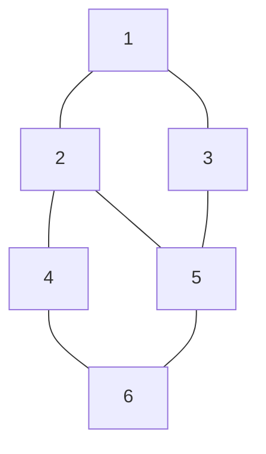

# Graph Representation Using Adjacency List in Java

Unlike an Adjacency Matrix, an Adjacency List stores only the connected vertices for each node.

## Graph Visualization



## Adjacency List Representation

```text
1 -> [2, 3]
2 -> [1, 4, 5]
3 -> [1, 5]
4 -> [2, 6]
5 -> [2, 3, 6]
6 -> [4, 5]
```

## Java Implementation

```java
import java.util.*;

class GFG {

    public static void main(String[] args) {

        int n = 6;

        // Create adjacency list
        ArrayList<ArrayList<Integer>> adj =
                new ArrayList<ArrayList<Integer>>();

        // Initialize list for each vertex
        for (int i = 0; i <= n; i++) {
            adj.add(new ArrayList<Integer>());
        }

        // Add edges
        addEdge(adj, 1, 2);
        addEdge(adj, 1, 3);
        addEdge(adj, 2, 4);
        addEdge(adj, 2, 5);
        addEdge(adj, 3, 5);
        addEdge(adj, 4, 6);
        addEdge(adj, 5, 6);

        // Print adjacency list
        for (int i = 1; i <= n; i++) {
            System.out.print(i + " -> ");

            for (int j = 0; j < adj.get(i).size(); j++) {
                System.out.print(adj.get(i).get(j) + " ");
            }

            System.out.println();
        }
    }

    // Function to add an undirected edge
    static void addEdge(ArrayList<ArrayList<Integer>> adj,
                        int u, int v) {

        adj.get(u).add(v);
        adj.get(v).add(u);
    }
}
```

## Output

```text
1 -> 2 3
2 -> 1 4 5
3 -> 1 5
4 -> 2 6
5 -> 2 3 6
6 -> 4 5
```

## Internal Structure

```text
adj
│
├── 0 -> []
├── 1 -> [2, 3]
├── 2 -> [1, 4, 5]
├── 3 -> [1, 5]
├── 4 -> [2, 6]
├── 5 -> [2, 3, 6]
└── 6 -> [4, 5]
```

## Visual Mapping

```text
        [2]
       /
[1]---+
       \
        [3]
         |
         |
        [5]-----[6]
       /         /
      /         /
    [2]-------[4]
```

## Complexity

| Operation          | Adjacency List      |
| ------------------ | ------------------- |
| Add Edge           | O(1)                |
| Traverse Neighbors | O(degree of vertex) |
| Check Edge         | O(degree of vertex) |
| Space              | O(V + E)            |

Where:

* **V** = Number of Vertices
* **E** = Number of Edges

### Matrix vs List

| Feature      | Adjacency Matrix | Adjacency List |
| ------------ | ---------------- | -------------- |
| Space        | O(V²)           | O(V + E)       |
| Edge Lookup  | O(1)             | O(degree)      |
| Best For     | Dense Graphs     | Sparse Graphs  |
| Memory Usage | High             | Low            |

For interview preparation, the adjacency list representation using `ArrayList<ArrayList<Integer>>` is the most commonly used approach in Java for BFS, DFS, shortest path, and graph traversal problems.
