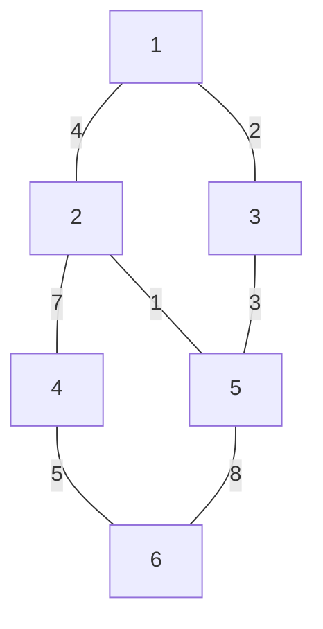

# Weighted Graph Representation in Java

Let's use the same 6-node graph, but now each edge has a weight.

## Graph Visualization



## Edge List

```text
1 --(4)-- 2
1 --(2)-- 3
2 --(7)-- 4
2 --(1)-- 5
3 --(3)-- 5
4 --(5)-- 6
5 --(8)-- 6
```

---

# 1. Weighted Graph Using Adjacency Matrix

## Matrix Representation

Store the **weight** instead of `1`.

```text
      1  2  3  4  5  6
    -------------------
1 |   0  4  2  0  0  0
2 |   4  0  0  7  1  0
3 |   2  0  0  0  3  0
4 |   0  7  0  0  0  5
5 |   0  1  3  0  0  8
6 |   0  0  0  5  8  0
```

`0` means no edge exists.

## Java Code

```java
import java.util.*;

public class WeightedMatrix {

    static void addEdge(int[][] adj, int u, int v, int wt) {
        adj[u][v] = wt;
        adj[v][u] = wt; // Undirected graph
    }

    public static void main(String[] args) {

        int n = 6;

        int[][] adj = new int[n + 1][n + 1];

        addEdge(adj, 1, 2, 4);
        addEdge(adj, 1, 3, 2);
        addEdge(adj, 2, 4, 7);
        addEdge(adj, 2, 5, 1);
        addEdge(adj, 3, 5, 3);
        addEdge(adj, 4, 6, 5);
        addEdge(adj, 5, 6, 8);

        System.out.println("Weighted Adjacency Matrix");

        for (int i = 1; i <= n; i++) {
            for (int j = 1; j <= n; j++) {
                System.out.print(adj[i][j] + "\t");
            }
            System.out.println();
        }
    }
}
```

## Output

```text
0 4 2 0 0 0
4 0 0 7 1 0
2 0 0 0 3 0
0 7 0 0 0 5
0 1 3 0 0 8
0 0 0 5 8 0
```

---

# 2. Weighted Graph Using Adjacency List

For weighted graphs, each neighbor must store:

* Destination Node
* Edge Weight

A common interview approach is creating a `Pair` class.

## Adjacency List Structure

```text
1 -> (2,4), (3,2)

2 -> (1,4), (4,7), (5,1)

3 -> (1,2), (5,3)

4 -> (2,7), (6,5)

5 -> (2,1), (3,3), (6,8)

6 -> (4,5), (5,8)
```

---

## Java Code

```java
import java.util.*;

class Pair {
    int node;
    int weight;

    Pair(int node, int weight) {
        this.node = node;
        this.weight = weight;
    }
}

public class WeightedAdjList {

    static void addEdge(
            ArrayList<ArrayList<Pair>> adj,
            int u,
            int v,
            int wt) {

        adj.get(u).add(new Pair(v, wt));
        adj.get(v).add(new Pair(u, wt));
    }

    public static void main(String[] args) {

        int n = 6;

        ArrayList<ArrayList<Pair>> adj =
                new ArrayList<>();

        for (int i = 0; i <= n; i++) {
            adj.add(new ArrayList<>());
        }

        addEdge(adj, 1, 2, 4);
        addEdge(adj, 1, 3, 2);
        addEdge(adj, 2, 4, 7);
        addEdge(adj, 2, 5, 1);
        addEdge(adj, 3, 5, 3);
        addEdge(adj, 4, 6, 5);
        addEdge(adj, 5, 6, 8);

        for (int i = 1; i <= n; i++) {

            System.out.print(i + " -> ");

            for (Pair p : adj.get(i)) {
                System.out.print(
                    "(" + p.node + "," + p.weight + ") "
                );
            }

            System.out.println();
        }
    }
}
```

## Output

```text
1 -> (2,4) (3,2)

2 -> (1,4) (4,7) (5,1)

3 -> (1,2) (5,3)

4 -> (2,7) (6,5)

5 -> (2,1) (3,3) (6,8)

6 -> (4,5) (5,8)
```

---

# Competitive Programming Style (Most Common)

Instead of a custom `Pair` class, many use:

```java
ArrayList<ArrayList<int[]>> adj;
```

where:

```java
adj.get(u).add(new int[]{v, wt});
```

Example:

```java
adj.get(1).add(new int[]{2, 4});
```

Meaning:

```text
Node 1
 └── Neighbor = 2
 └── Weight   = 4
```

This format is frequently used in:

* Dijkstra's Algorithm
* Prim's Algorithm
* Shortest Path problems
* Graph interview questions

because it is concise and avoids creating extra classes.
