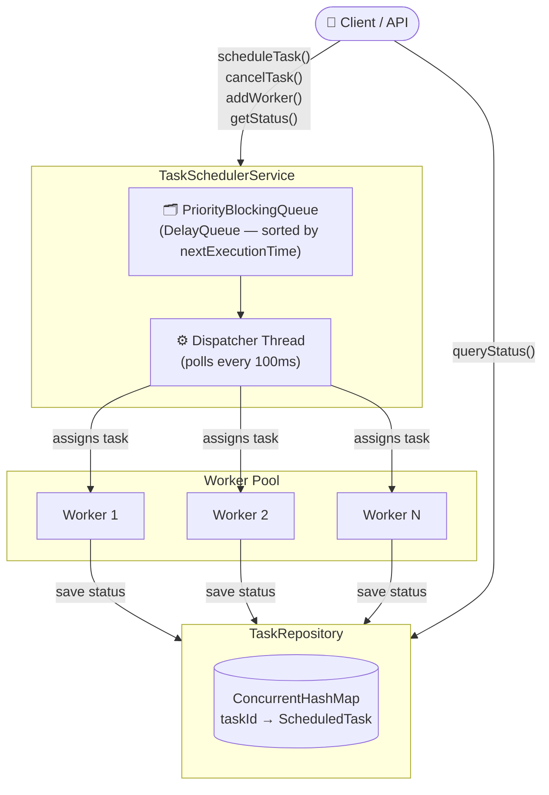
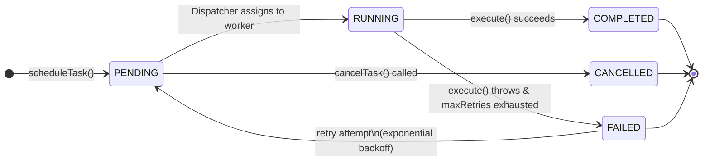
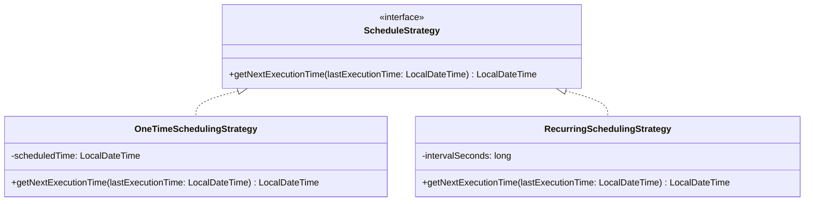
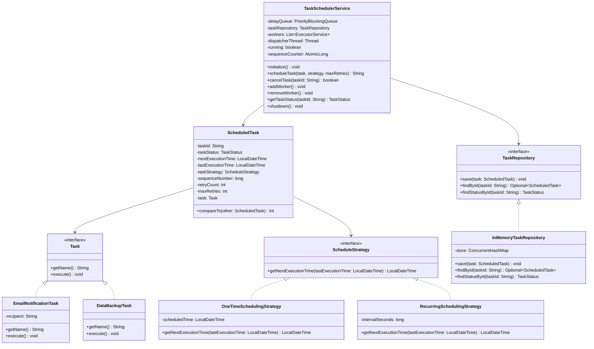
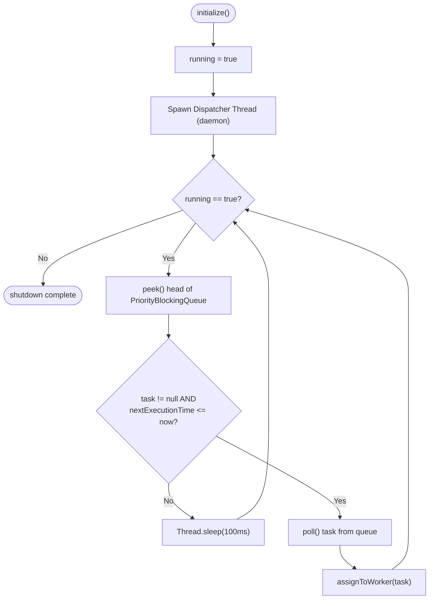
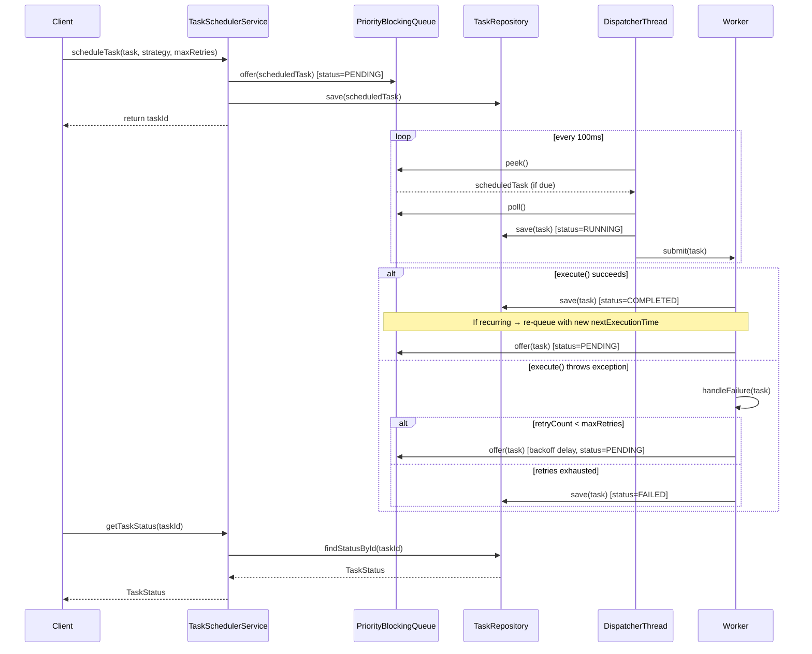
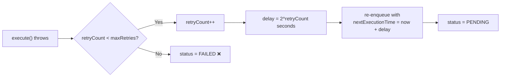
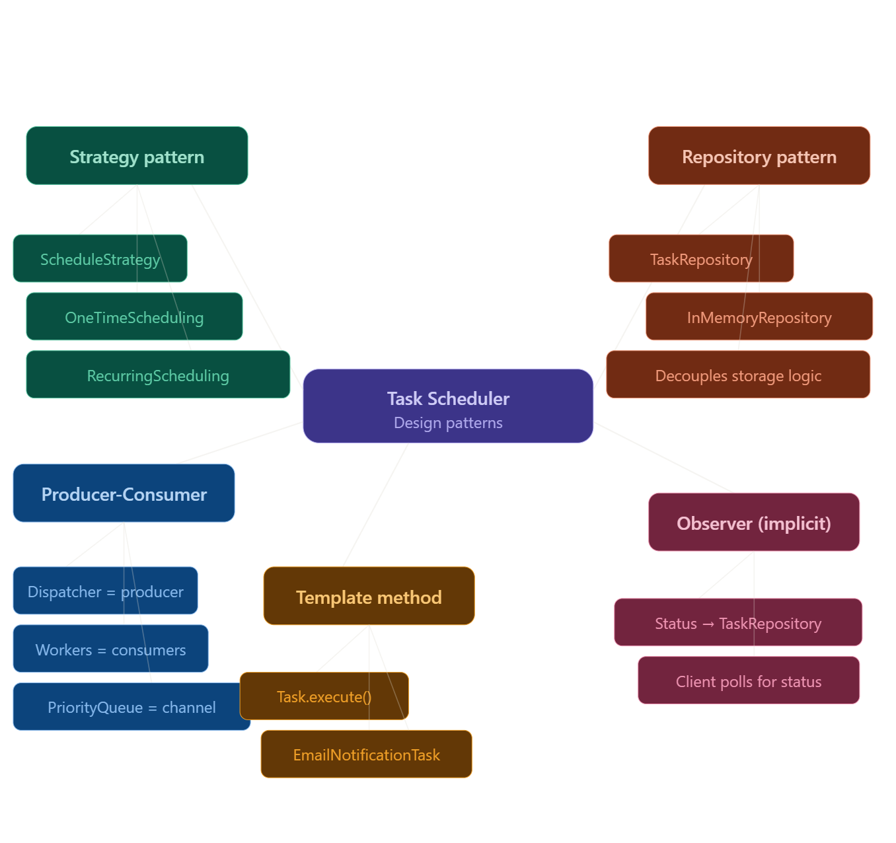

# Concurrent Task Scheduler with Dynamic Load Management

> **Interview Difficulty:** Hard | **Asked at:** Amazon, DE Shaw, Oracle
>
> **Category:** System Design · Distributed Systems · Concurrency
>
> **Source:** https://leetcode.com/discuss/post/8334514/design-a-concurrent-task-scheduler-with-0f2mp/
>
> **Tags:** `#SystemDesign` `#Java` `#Concurrency` `#DistributedSystems` `#InterviewPrep`

---

## 📌 What Is This?

A **Concurrent Task Scheduler** is a system that accepts tasks (one-time or recurring), assigns them to available workers from a managed pool, tracks their lifecycle, and ensures fault tolerance — all while maintaining fairness and throughput across the pool.

Think of it like a **mini AWS Lambda scheduler** or **Quartz Scheduler** built from first principles.

---

## 🧩 Core Concepts at a Glance

| Concept                     | Description                                                           |
| --------------------------- | --------------------------------------------------------------------- |
| **Worker Pool**       | A set of worker threads/nodes that execute tasks                      |
| **Delay Queue**       | A priority queue that holds tasks sorted by their next execution time |
| **Dispatcher Thread** | Continuously polls the queue and assigns tasks to free workers        |
| **Task Strategy**     | Encapsulates*when*a task should run (one-time or recurring)         |
| **Task Repository**   | Persistence layer for task state tracking                             |

---

## 🗺️ High-Level System Architecture



---

## 🗂️ Entity Design

### 1. `Task` Interface

The base contract every task must fulfill.

```java
public interface Task {
    String getName();
    void execute();
}
```

Concrete Implementations:

* `EmailNotificationTask` — sends an email on execution
* `DataBackupTask` — triggers a data backup job

---

### 2. `TaskStatus` — Lifecycle States



```java
public enum TaskStatus {
    PENDING,    // Submitted, waiting to be picked up
    RUNNING,    // Assigned to a worker, currently executing
    COMPLETED,  // Successfully finished
    FAILED,     // Threw an exception during execution
    CANCELLED   // Explicitly cancelled before execution
}
```

---

### 3. `ScheduleStrategy` — Class Hierarchy



```java
public interface ScheduleStrategy {
    LocalDateTime getNextExecutionTime(LocalDateTime lastExecutionTime);
}

// Runs exactly once at a future time
public class OneTimeSchedulingStrategy implements ScheduleStrategy {
    private final LocalDateTime scheduledTime;

    @Override
    public LocalDateTime getNextExecutionTime(LocalDateTime lastExecutionTime) {
        return scheduledTime;
    }
}

// Runs repeatedly at a fixed interval
public class RecurringSchedulingStrategy implements ScheduleStrategy {
    private final long intervalSeconds;

    @Override
    public LocalDateTime getNextExecutionTime(LocalDateTime lastExecutionTime) {
        return (lastExecutionTime != null)
            ? lastExecutionTime.plusSeconds(intervalSeconds)
            : LocalDateTime.now().plusSeconds(intervalSeconds);
    }
}
```

---

### 4. Full Class Diagram



---

### 5. `ScheduledTask`

The wrapper around a `Task` that adds all scheduling metadata.

```java
public class ScheduledTask implements Comparable<ScheduledTask> {
    private final String taskId;
    private TaskStatus taskStatus;
    private LocalDateTime nextExecutionTime;
    private LocalDateTime lastExecutionTime;
    private final ScheduleStrategy taskStrategy;
    private long sequenceNumber;         // Tiebreaker for equal priority
    private int retryCount;
    private final int maxRetries;
    private final Task task;

    @Override
    public int compareTo(ScheduledTask other) {
        int timeCompare = this.nextExecutionTime.compareTo(other.nextExecutionTime);
        if (timeCompare != 0) return timeCompare;
        return Long.compare(this.sequenceNumber, other.sequenceNumber);
    }
}
```

> **Why `Comparable`?**
>
> `ScheduledTask` lives in a `PriorityBlockingQueue` (the delay queue). The comparator ensures tasks due soonest are dispatched first. `sequenceNumber` breaks ties by insertion order (FIFO).

---

## ⚙️ Core Service: `TaskSchedulerService`

This is the  **heart of the system** . It owns the queue, workers, and dispatcher.

### Dispatcher Loop Flow



---

### Task Execution Flow



---

### Retry with Exponential Backoff



```java
private void handleFailure(ScheduledTask task) {
    if (task.getRetryCount() < task.getMaxRetries()) {
        task.incrementRetryCount();
        task.setTaskStatus(TaskStatus.PENDING);
        // Exponential backoff: 2^retryCount seconds
        long backoffSeconds = (long) Math.pow(2, task.getRetryCount());
        task.setNextExecutionTime(LocalDateTime.now().plusSeconds(backoffSeconds));
        delayQueue.offer(task);
    } else {
        task.setTaskStatus(TaskStatus.FAILED);
    }
}
```

---

### `initialize()` — Start the Engine

```java
public void initialize() {
    running = true;
    dispatcherThread = new Thread(() -> {
        while (running) {
            try {
                ScheduledTask task = delayQueue.peek();
                if (task != null &&
                    !task.getNextExecutionTime().isAfter(LocalDateTime.now())) {
                    delayQueue.poll();
                    assignToWorker(task);
                } else {
                    Thread.sleep(100); // Polling interval
                }
            } catch (InterruptedException e) {
                Thread.currentThread().interrupt();
            }
        }
    });
    dispatcherThread.setDaemon(true);
    dispatcherThread.start();
}
```

---

### `scheduleTask()` — Submit a Task

```java
public String scheduleTask(Task task, ScheduleStrategy strategy, int maxRetries) {
    String taskId = UUID.randomUUID().toString();
    ScheduledTask scheduledTask = new ScheduledTask(
        taskId, task, strategy, maxRetries, sequenceCounter.getAndIncrement()
    );
    scheduledTask.setNextExecutionTime(strategy.getNextExecutionTime(null));
    scheduledTask.setTaskStatus(TaskStatus.PENDING);
    taskRepository.save(scheduledTask);
    delayQueue.offer(scheduledTask);
    return taskId;
}
```

---

### `cancelTask()`

```java
public boolean cancelTask(String taskId) {
    Optional<ScheduledTask> opt = taskRepository.findById(taskId);
    if (opt.isPresent()) {
        ScheduledTask task = opt.get();
        if (task.getTaskStatus() == TaskStatus.PENDING) {
            task.setTaskStatus(TaskStatus.CANCELLED);
            delayQueue.remove(task);
            taskRepository.save(task);
            return true;
        }
    }
    return false; // Can't cancel a RUNNING task
}
```

---

### `addWorker()` / `removeWorker()`

```java
public void addWorker() {
    workers.add(Executors.newSingleThreadExecutor());
}

public void removeWorker() {
    if (!workers.isEmpty()) {
        ExecutorService worker = workers.remove(workers.size() - 1);
        worker.shutdown(); // Graceful shutdown
    }
}
```

---

## 🔬 One-Time vs Recurring Task Timeline

```mermaid
gantt
    title Task Execution Timeline
    dateFormat HH:mm:ss
    axisFormat %H:%M:%S

    section One-Time Task
    PENDING (waiting)         :done,    p1, 00:00:00, 5s
    RUNNING (execute)         :active,  r1, 00:00:05, 3s
    COMPLETED                 :crit,    c1, 00:00:08, 1s

    section Recurring Task (every 10s)
    PENDING                   :done,    p2, 00:00:00, 3s
    RUNNING (run 1)           :active,  r2, 00:00:03, 2s
    PENDING (waiting)         :done,    p3, 00:00:05, 10s
    RUNNING (run 2)           :active,  r3, 00:00:15, 2s
    PENDING (waiting)         :done,    p4, 00:00:17, 10s
    RUNNING (run 3)           :active,  r4, 00:00:27, 2s

    section Failed Task (with retry)
    PENDING                   :done,    p5, 00:00:00, 2s
    RUNNING → FAILED          :crit,    f1, 00:00:02, 2s
    PENDING (backoff 2s)      :done,    p6, 00:00:04, 2s
    RUNNING → FAILED          :crit,    f2, 00:00:06, 2s
    PENDING (backoff 4s)      :done,    p7, 00:00:08, 4s
    RUNNING → COMPLETED       :active,  s1, 00:00:12, 2s
```



---

## 🏗️ Design Patterns Used



---

## ⚖️ Trade-offs & Design Decisions

### Why `PriorityBlockingQueue` over a simple `BlockingQueue`?

Because we need tasks sorted by `nextExecutionTime`. A plain `LinkedBlockingQueue` is FIFO — it can't prioritize urgent tasks over later-scheduled ones.

### Why a Dispatcher Thread instead of direct submission?

Direct submission would require the caller's thread to block until a worker is available. A dedicated dispatcher allows the caller to return immediately after enqueueing, while the dispatcher handles worker assignment asynchronously.

### Why `volatile boolean running`?

The `running` flag is read by the dispatcher thread and written by the main thread. Without `volatile`, the JVM may cache the old value in the dispatcher thread's local cache and never see the `false` written during shutdown.

### Why Exponential Backoff for retries?

Immediate retry on a failure (e.g., DB timeout) often hits the same error again. Exponential backoff (`2^n` seconds) gives the failing system time to recover before the next attempt.

---

## 📊 Complexity Analysis

| Operation                | Time Complexity              |
| ------------------------ | ---------------------------- |
| `scheduleTask()`       | O(log n) — queue insertion  |
| `cancelTask()`         | O(n) — scan queue to remove |
| `getTaskStatus()`      | O(1) — hash map lookup      |
| `dispatcherThread`poll | O(log n) — queue removal    |
| Worker assignment        | O(W) — iterate worker list  |

> *n = tasks in queue, W = number of workers*

---

## 🚀 Demo Usage

```java
public class TaskSchedulerDemo {
    public static void main(String[] args) throws InterruptedException {
        TaskSchedulerService scheduler = new TaskSchedulerService(3); // 3 workers
        scheduler.initialize();

        // One-time task: run 5 seconds from now
        String id1 = scheduler.scheduleTask(
            new EmailNotificationTask("user@example.com"),
            new OneTimeSchedulingStrategy(LocalDateTime.now().plusSeconds(5)),
            3 // max retries
        );

        // Recurring task: run every 10 seconds
        String id2 = scheduler.scheduleTask(
            new DataBackupTask(),
            new RecurringSchedulingStrategy(10),
            2
        );

        // Query status
        System.out.println("Task 1 status: " + scheduler.getTaskStatus(id1));

        // Cancel a task
        boolean cancelled = scheduler.cancelTask(id2);
        System.out.println("Task 2 cancelled: " + cancelled);

        // Add more capacity dynamically
        scheduler.addWorker();

        Thread.sleep(30_000);
        scheduler.shutdown();
    }
}
```

---

## 💡 Key Interview Talking Points

1. **Thread safety** — `PriorityBlockingQueue` is thread-safe. `ConcurrentHashMap` in the repository avoids explicit locks. `AtomicLong` for sequence numbers avoids race conditions.
2. **Graceful shutdown** — `ExecutorService.shutdown()` on workers waits for in-flight tasks. Dispatcher thread is a daemon so it doesn't block JVM exit.
3. **Idempotency** — For distributed deployments, tasks should be idempotent (safe to re-execute on retry) since failures can trigger re-queuing.
4. **Scaling** — For horizontal scaling, replace the in-memory queue with a distributed queue (Redis Sorted Set, Kafka with timestamps, or SQS delays) and the in-memory repository with a distributed store (Postgres, DynamoDB).
5. **Monitoring** — Track `FAILED` task rates, queue depth, worker utilization, and average task lag (now − scheduled time) as key operational metrics.

---

## 🔗 Extended Reading

* Java `ScheduledExecutorService` — standard library equivalent
* Quartz Scheduler — production-grade Java scheduler
* Celery (Python) — distributed task queue
* AWS Step Functions — managed distributed workflow scheduler
* Redis Sorted Sets — common backend for distributed delay queues

---

*Last Updated: June 2026*
