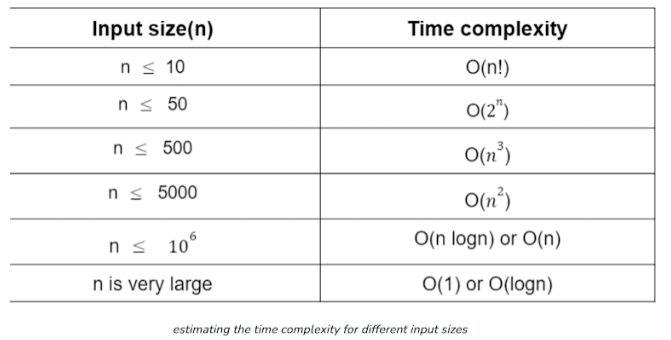

# DSA Pattern Recognition Guide

> Most DSA interview questions are variations of a handful of common patterns. Instead of memorizing solutions, focus on recognizing which pattern fits the problem. Once you identify the pattern, applying the right approach becomes much easier.
>
> Link : [docs.google.com/document/d/104WvhyFgVv9xU6_jdGhbIfwDyF5GLgvTt2b21DP8Z28/mobilebasic](https://docs.google.com/document/d/104WvhyFgVv9xU6_jdGhbIfwDyF5GLgvTt2b21DP8Z28/mobilebasic)

---

## Contents

| # | Pattern                                           | #  | Pattern                                                            |
| --- | --------------------------------------------------- | ---- | -------------------------------------------------------------------- |
| 1 | [Prefix Sum](#1-prefix-sum)                       | 9  | [Difference Array](#9-difference-array)                            |
| 2 | [Two Pointers](#2-two-pointers)                   | 10 | [Tree Traversal](#10-tree-traversal)                               |
| 3 | [Sliding Window](#3-sliding-window)               | 11 | [Depth First Search (DFS)](#11-depth-first-search-dfs)             |
| 4 | [Fast & Slow Pointers](#4-fast--slow-pointers)    | 12 | [Breadth First Search (BFS)](#12-breadth-first-search-bfs)         |
| 5 | [Monotonic Stack](#5-monotonic-stack)             | 13 | [Matrix Traversal](#13-matrix-traversal)                           |
| 6 | [Top K Elements](#6-top-k-elements)               | 14 | [Linked List In-place Reversal](#14-linked-list-in-place-reversal) |
| 7 | [Overlapping Intervals](#7-overlapping-intervals) | 15 | [Backtracking](#15-backtracking)                                   |
| 8 | [Binary Search](#8-binary-search)                 | 16 | [Dynamic Programming (DP)](#16-dynamic-programming-dp)             |

---

## 1. Prefix Sum

**Use:** Problems requiring range sum queries on arrays.

- Precompute prefix sums to answer each query in **O(1)**.
- Efficient for multiple range sum queries on a static array.

---

## 2. Two Pointers

**Use:** String and array problems involving comparisons or finding pairs.

- Use two pointers moving towards or away from each other.
- Efficient for sorted arrays, palindrome checks, and pair/triplet problems.

---

## 3. Sliding Window

**Use:** Finding contiguous subarrays/substrings satisfying specific conditions.

- Maintain a fixed or variable-size window using two pointers.
- Avoids recomputing results for every window, reducing time complexity.

---

## 4. Fast & Slow Pointers

**Use:** Linked list and cycle detection problems.

- Use two pointers moving at different speeds.
- Detects cycles and finds the middle node in a single traversal.

---

## 5. Monotonic Stack

**Use:** Problems involving the next/previous greater or smaller element.

- Maintain a monotonic increasing/decreasing stack.
- Optimizes many nested-loop solutions into linear time.

---

## 6. Top K Elements

**Use:** Finding the K largest/smallest or most frequent elements.

- Use a **Heap (Priority Queue)** to maintain only the top K elements.
- More efficient than sorting the entire array.

---

## 7. Overlapping Intervals

**Use:** Problems involving intervals or ranges.

- Sort intervals before processing them.
- Merge, insert, or detect overlapping intervals efficiently.

---

## 8. Binary Search

**Use:** Searching in sorted, rotated, or answer-search spaces.

- Repeatedly halve the search space.
- Also useful for **Binary Search on Answer** problems (minimize maximum / maximize minimum).

---

## 9. Difference Array

**Use:** Multiple range update queries on arrays.

- Update only the range boundaries instead of every element.
- Compute the final array using a **Prefix Sum**.

---

## 10. Tree Traversal

**Use:** Problems requiring traversal of every node in a binary tree.

- Use Preorder, Inorder, Postorder, or Level Order traversal.
- Choose the traversal based on the information required.

---

## 11. Depth First Search (DFS)

**Use:** Exploring every possible path in trees or graphs.

- Use recursion or an explicit stack.
- Ideal for traversal, connected components, and cycle detection.

---

## 12. Breadth First Search (BFS)

**Use:** Level-by-level traversal or shortest path in unweighted graphs.

- Use a **Queue** to process nodes level-wise.
- Ideal for minimum steps and shortest path problems.

---

## 13. Matrix Traversal

**Use:** Grid-based problems like islands, flood fill, or path finding.

- Treat the matrix as a graph.
- Use DFS or BFS to explore neighbouring cells.

---

## 14. Linked List In-place Reversal

**Use:** Problems requiring pointer rearrangement in linked lists.

- Reverse pointers without using extra space.
- Useful for reversing entire lists or specific portions.

---

## 15. Backtracking

**Use:** Problems involving all possible combinations or permutations.

- Recursively explore every possible choice.
- Backtrack whenever a path cannot lead to a valid solution.

---

## 16. Dynamic Programming (DP)

**Use:** Optimization problems with overlapping subproblems.

- Store intermediate results to avoid repeated computation.
- Used for maximization, minimization, and counting problems.

---

# Interview Tips & Tricks

- Whenever a **Binary Tree** is involved, think **Recursion** first. Define a base case and make the input smaller with each recursive call.
- For a **Binary Search Tree (BST)**, always exploit the property: `Left < Root < Right`.
- If the problem asks to **minimize the maximum** or **maximize the minimum**, think **Binary Search on Answer**.
- When multiple approaches are possible, think **Greedy** before **Dynamic Programming**.
- For **Directed Graphs**, consider using **In-degree** and **Out-degree**.
- If the problem involves **Prime Numbers**, think **Sieve of Eratosthenes** or **Bit Manipulation**.
- **Constraints** often reveal the expected time complexity.
- 
